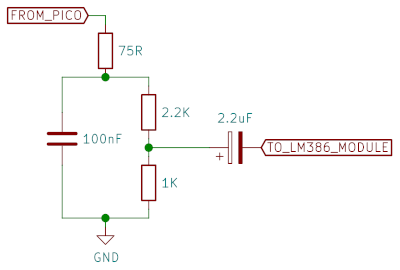
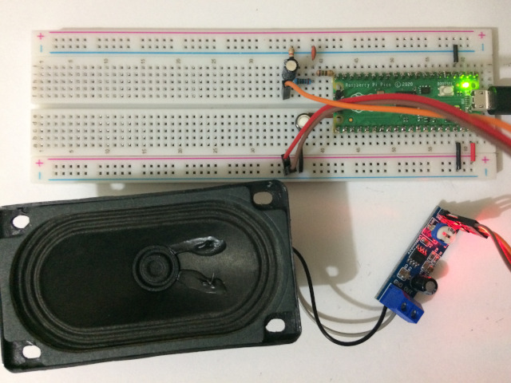
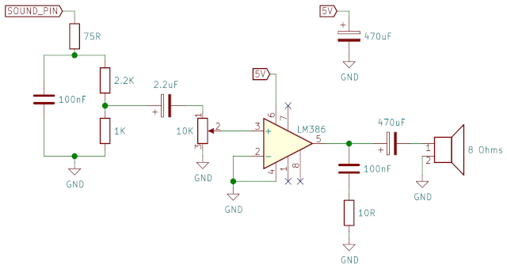
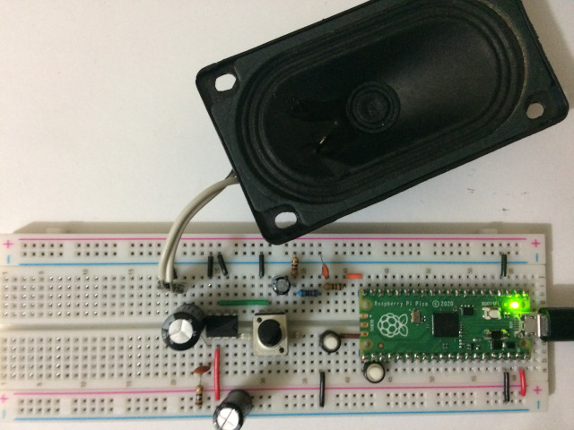

# pico-mod-player

A simple MOD player for the Raspberry Pi Pico.

The audio output code is based on the PWM/DMA code described in [this
blog post](https://gregchadwick.co.uk/blog/playing-with-the-pico-pt3/)
by Greg Chadwick.

The MOD player is currently very basic, outputing mono with 8 bits per
sample and doesn't support many MOD effects (like tremolo and
vibrato).  Still, it does a nice enough job of playing most MODs I've
tested so far.

To convert a MOD file for playing in the Pico you'll need the `mod2h`
tool from [this project](https://github.com/moefh/mod-tools) to
convert the MOD file to a C header file for inclusion in the code.


## Using an External Amplifier Module

The sound is output to the selected pin as PWM, so you'll need a
capacitor to smooth the waveform, some resistors to lower the voltage
level and a coupling capacitor to remove the DC offset.  Here's what I
used to send the sound over to a [cheap LM386
module](https://pt.aliexpress.com/item/32664418371.html):



And this is the setup on a breadboard connected to the LM386 module:



This setup will likely work well with other amplifier modules. If you
have a stereo module, just connect the single output to both left and
right inputs of the amplifier module.

The output of the module is connected to a small 8Ω speaker.

## Using an LM386 Chip as the Amplifier

An alternative is to use just the LM386 chip, here's the schematic I
used (it mixes the previous schematic and a schematic taken from
the LM386 datasheet):



And this is the setup on a breadboard with the LM386 chip:



As before, the output of the amplifier is connected to a small 8Ω speaker.


## Source Code

To build the code, make sure you have the **pico-sdk** installed
correctly, and then:

```
git clone https://github.com/moefh/pico-mod-player.git
cd pico-mod-player
mkdir build
cd build
cmake ..
make
```

This will build two binaries you can send to the Pico:
`simple/simple_mod_player.uf2` and `async/async_mod_player.uf2`.

### Simple Player

The "simple" MOD player in the directory `simple/` plays the MOD in
the main CPU core (the core where your code starts running in
`main()`).  It must periodically call the MOD player to fill the
output sound buffer from your main loop; something like (see
`simple/main.c`):

```C
// [...]

#include "audio.h"
#include "mod_play.h"

static void update_mod_player(void)
{
  uint8_t *audio_buffer = audio_get_buffer();
  if (audio_buffer) {
    mod_play_step(audio_buffer, AUDIO_BUFFER_SIZE);
  }
}

// [...]

int main(void)
{
  // [...]

  audio_init(/* ... stuff ... */);
  mod_play_start(/* ... stuff ... */);

  while (1) {
    // [...]
    update_mod_player();
  }
}
```


### Asynchronous Player

The "async" MOD player in the directory `async/` plays the MOD from
the second CPU core (`core1`).  It tells the MOD to start playing
and forgets about it (see `async/main.c`):

```C
// [...]

#include "async_msg.h"
#include "mod_data.h"

// [...]

int main(void)
{
  // [...]

  async_init();
  async_audio_init(/* ... same stuff as before */);
  async_mod_start(/* ... same stuff as before */);

  while (1) {
    // no need to update the MOD player here
  }
}
```


## License

The source code is distributed under the MIT License.

This project includes the MOD song "[The
Soft-liner](https://modarchive.org/index.php?request=view_by_moduleid&query=61156)"
by Zilly Mike, licensed under Creative Commons [CC BY
3.0](https://creativecommons.org/licenses/by/3.0/). No changes were
made other than the conversion from the MOD to a header file for
inclusion in the code.
